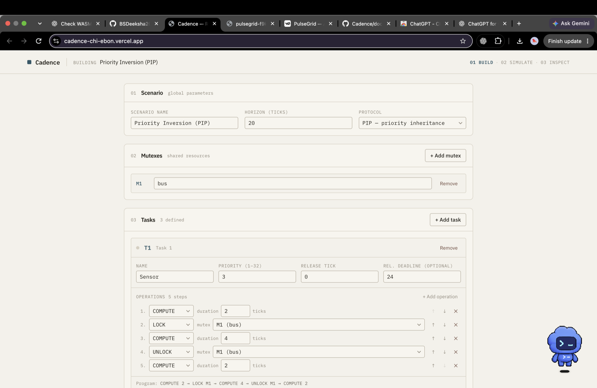
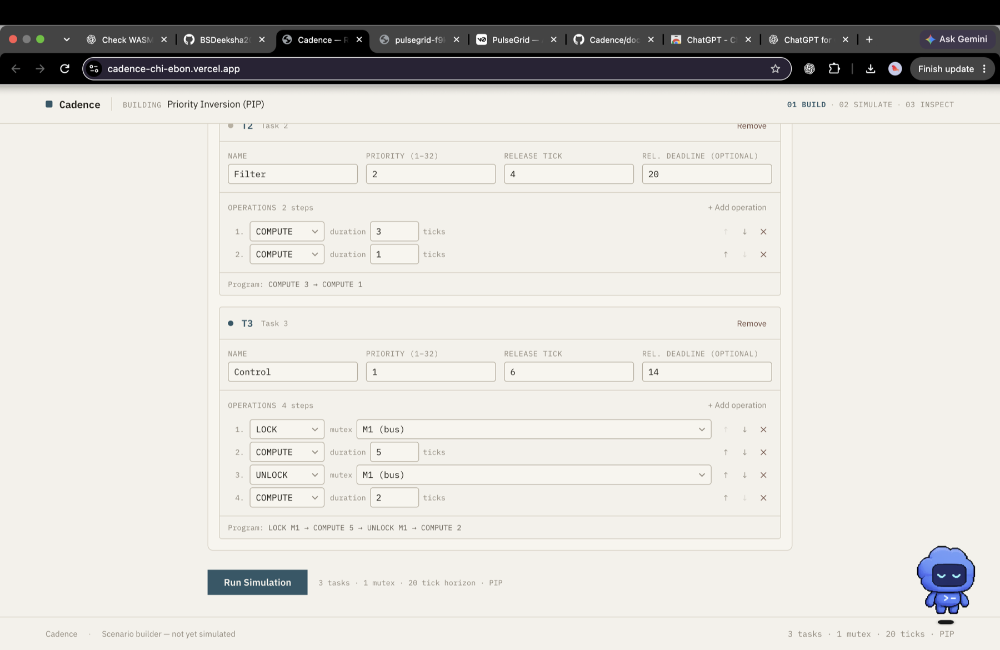
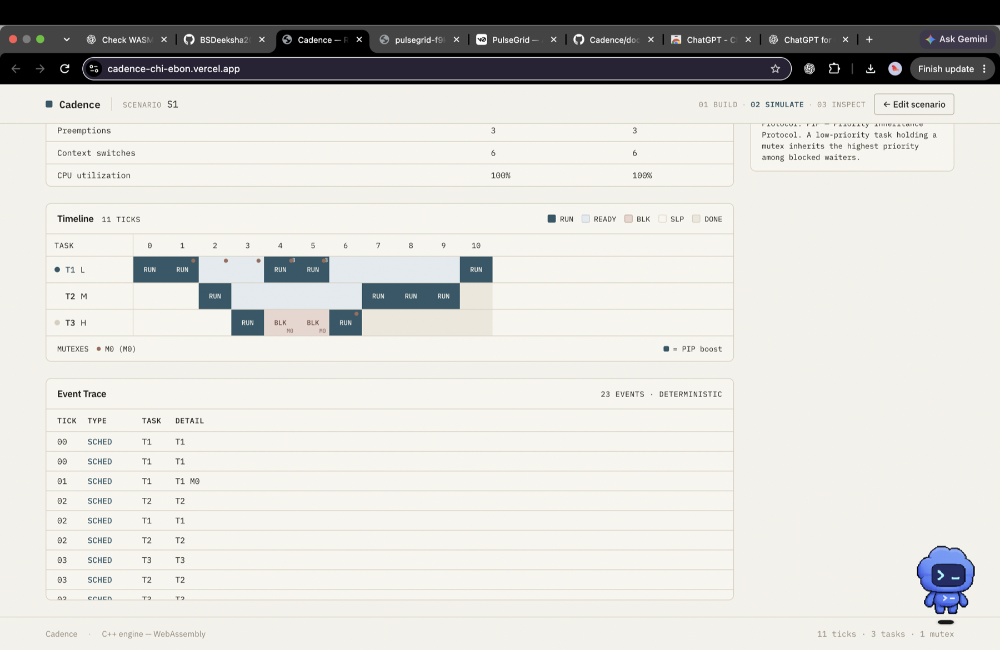

# Cadence

**Deterministic Real-Time Scheduling & Priority Inversion Simulator**

Cadence is a C++17 simulator for fixed-priority scheduling on one CPU. It demonstrates how a low-priority task holding a mutex can delay a high-priority task, and how Priority Inheritance Protocol (PIP) changes that schedule.

[Open the live demo](https://cadence-chi-ebon.vercel.app/) · [View the GitHub repository](https://github.com/BSDeeksha2005/Cadence)

## Screenshots

### Scenario builder



<details>
<summary>Task operation editor</summary>



</details>

### S1 simulation and trace



## What it demonstrates

In the S1 scenario, low-priority task L holds a mutex when high-priority task H needs it. With protocol `NONE`, medium-priority task M can run ahead of L, extending H's wait. With PIP, L temporarily inherits H's priority, finishes the critical section sooner, and releases H.

The simulation uses integer ticks and deterministic event ordering. It is single-threaded and models one CPU; simulated tasks are not operating-system threads. The core does not use floating-point scheduling logic.

## S1 results

The hand-derived golden execution sequences are:

- `NONE`: `L L M H M M M L L H L`
- `PIP`: `L L M H L L H M M M L`

PIP reduces H's response time from 7 ticks to 4 and its inversion time from 3 ticks to 0. Both runs complete at tick 11 with 100% CPU utilization. The checked-in [CLI output and metrics](docs/demo/S1-NONE-PIP.txt) include trace hashes and per-task results. Task IDs in that output are L=0, M=1, H=2.

## Architecture and current scope

- `include/cadence` and `src` contain the C++17 simulation core and native CLI.
- `tests` contains the GoogleTest suite, including hand-written S1 golden expectations.
- `wasm` contains the C++/WebAssembly bridge source; `frontend/src/wasm` contains the browser bindings and trace adapter.
- `frontend` is the Vite/React interface, which compares the built-in S1 run under `NONE` and `PIP`.

The current web demo runs the built-in S1 scenario. Arbitrary scenarios edited in the builder, S2, periodic tasks, multicore scheduling, and other protocols are not implemented. This is a simulator, not an RTOS, and it is not production-certified.

`SEMANTICS.md` is the normative definition of the simulation behavior.

## Build and run the C++ simulator

From the repository root:

```sh
cmake -S . -B build
cmake --build build
ctest --test-dir build --output-on-failure
./build/cadence --both
```

Use `./build/cadence --none` or `./build/cadence --pip` to run one protocol.

### Sanitizer build

```sh
cmake -S . -B build-san -DCADENCE_SANITIZE=ON
cmake --build build-san
ctest --test-dir build-san --output-on-failure
```

## Run or build the web app

```sh
cd frontend
npm ci
npm run dev
```

Create the production frontend bundle with `npm run build` from `frontend/`; Vite writes it to `frontend/dist`.

The existing Vercel project is connected to this GitHub repository. Its frontend root is `frontend`, with `npm run build` as the build command and `dist` as the output directory. Pushing a commit to the connected production branch triggers a deployment.
